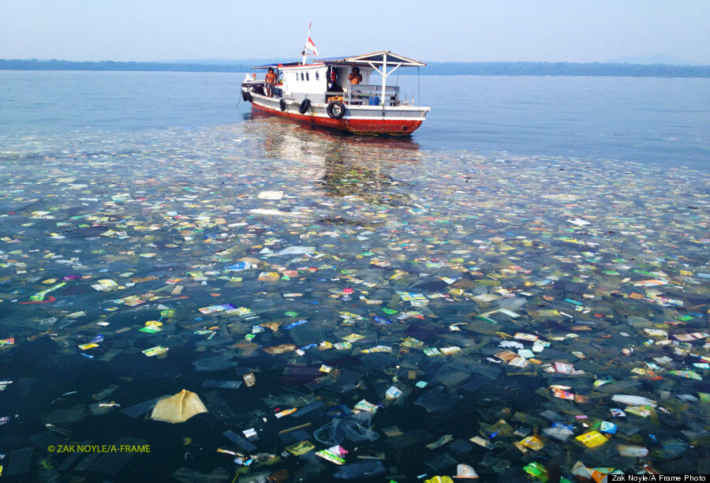
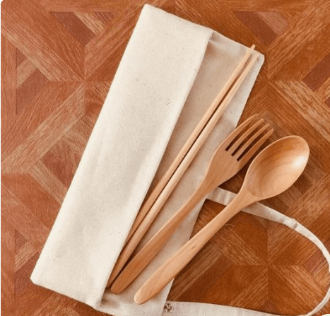
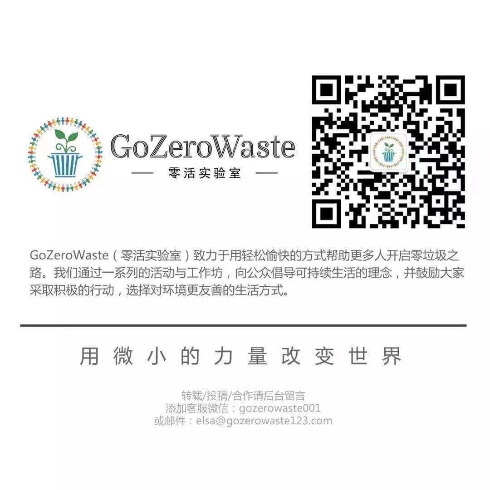

# 海洋污染现状

## 大量塑胶废料正在侵染我们的江河湖海，陆地上堆积如山的垃圾悄然威胁着野生动植物的生命安全。  
The billions upon billions of items of plastic waste choking our oceans, lakes, and rivers and piling up on land is more than unsightly and harmful to plants and wildlife.

  

- 每年有大约八百万吨塑料垃圾被倾倒入海洋，其中二十三万七千吨是微型塑料（小于小指指甲盖的破碎塑料碎片）；
About 8 million metric tons of plastic are thrown into the ocean annually. Of those, 236,000 tons are microplastics – tiny pieces of broken-down plastic smaller than your little fingernail 
- 平均每分钟有一卡车垃圾被倾倒入海洋；
Every minute, one garbage truck of plastic is dumped into our oceans
- 2020年，海洋中的塑料垃圾将比现在增加十倍
The amount of plastic in the ocean is set to increase tenfold by 2020
- 预计到2050年，海洋中的塑料垃圾重量将超过在其中生活的鱼类；
By 2050 there will be more plastic in the oceans than there are fish (by weight)
- 塑料在深度为11公里的深海海底被发现，这意味着塑料污染已蔓延到这个世界最偏远的角落；
Plastic is found in the ocean as far as 11km deep, meaning synthetic fibers have contaminated even the most remote places on Earth
- 一些海洋生物会误食塑料，这些动物最终大多挨饿而死。原因是塑料无法被消化分解而堆积在它们的胃里，使它们无法进食，最终因饥饿而痛苦地死去某些人类食用鱼类也受到微型塑料纤维的侵袭，其中包括褐鳟、加拿大白鲑、鲈鱼。
Many marine organisms can’t distinguish common plastic items from food. Animals who eat plastic often starve because they can’t digest the plastic and it fills their stomachs, preventing them from eating real food. There is more plastic than natural prey at the sea surface of the Great Pacific Garbage Patch, which means that organisms feeding at this area are likely to have plastic as a major component of their diets. For instance, sea turtles by-caught in fisheries operating within and around the
- 自从海洋塑料泛滥后，珊瑚虫的死亡率从4%增长到89%，塑料还损害珊瑚虫的皮肤，增加它们感染的风险。珊瑚礁是海洋中超过25%生物赖以生存的栖息地；
The likelihood of coral becoming diseased increases from 4% to 89% after coming in contact with marine plastic. It also damages the skin of coral, allowing infection. Coral reefs are home to more than 25% of marine life.
### 想要了解更多塑料污染的危害和影响，学习减少塑料消费的技巧，请立即下载我们的Plastic Pollution Primer and Toolkit。

# 我们能做什么减少垃圾
- 观察每天产生的垃圾，写一篇垃圾日记
Keep a trash diary
- 自带餐具、水杯、食品包装袋子、吸管
Bring your own bag， cup， steel straw and tableware set 

  

- 观看环保纪录片
A documentary on sustainability
- 变废为宝, 垃圾都是被放错的资源
Trash to treasure
- 关注环保相关微信公众号推荐GoZeroWaste，下载21天零垃圾手册，手把手教你如何过上零垃圾的环保生活。
Keep up with the wechat account GoZeroWaste, download Days to Zero Waste help you transform to sustainable living.

  
  
